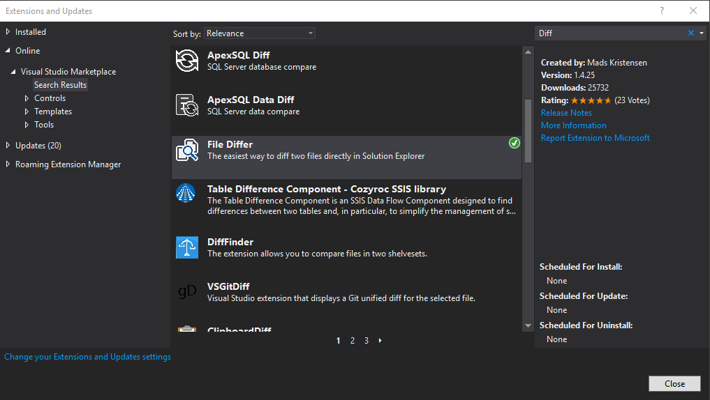
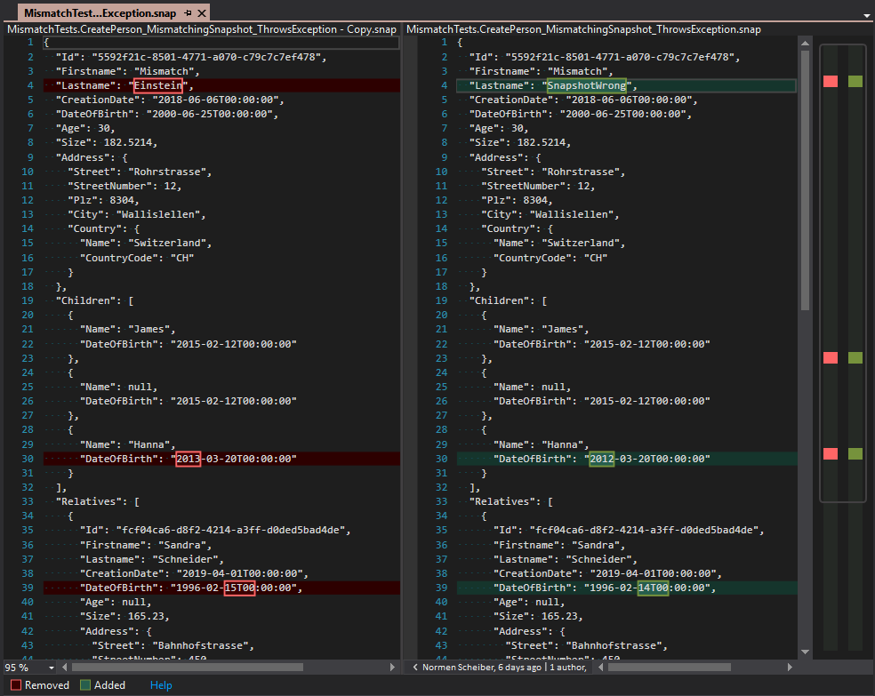

In some cases, snapshots can get really big, for example in
integration or system tests. Now, if you have a snapshot mismatch with several
unequal values, it can become quiet unhandy to find them, especially if you
have only a small error message.

This is one of the reasons, why we extended the mismatch behaviour...
Now in case of a snapshot mismatch, Snapshooter not only shows you an error message,
it also stores the mismatching snapshot
in the `__snapshot__\__mismatch__` folder.
([see Snapshot Mismatch Handling](https://swisslife-oss.github.io/snapshooter/docs/snapshot-mismatch-handling))  
Therefore the original snapshot can be compared with the mismatching snapshot
by a file compare tool, and you can see the differences much faster.

An even faster way is in our opinion to use a Visual Studio (Code) extension for file
comparison....

<!--truncate-->

## Install File Differ Tool

Install one of the File Compare extensions in Visual Studio, there are several
out there (File Differ, FileComparer, VS Diff, VsCommands etc.)...

FileDiffer Example:

## Compare Files in Visual Studio

If you have a mismatching snapshot, you can just open the solution explorer
in your Visual Studio and compare the two files. Select both of them, open via
right-click the menu and select "Compare Files..."

This gives you a quit better overview about the changes between your snapshots...

